## No relevant disclosures

## Objectives

After attending this presentation, the participant will

- Appreciate the potential of social media tools in delivering content to learners
- Recognize the capabilities and limitations of social media metrics in data analysis

----

 <!-- link directly to image on Web -->

----

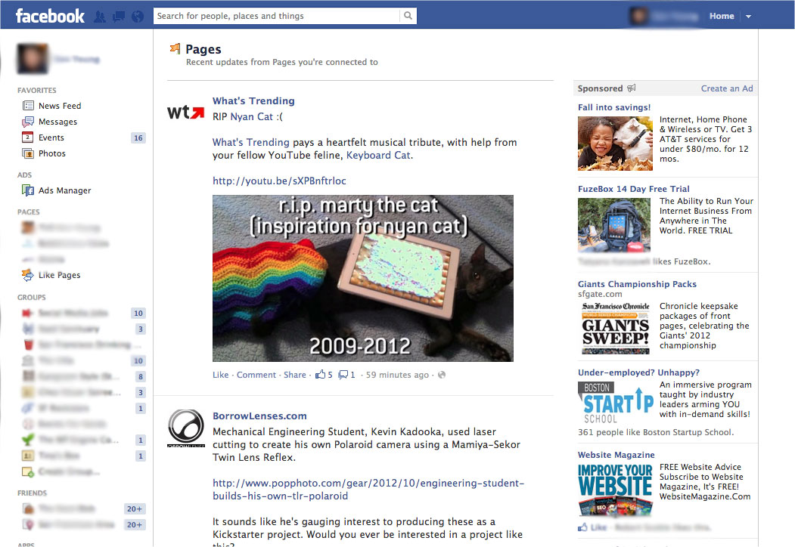 <!-- link directly to image on Web -->

----

<aside class="notes">
    Facebook has transformed from predominantly peer-to-peer interaction to where organizations promote themselves via Pages. This pilot project exploits that phenomenon.
</aside>

----

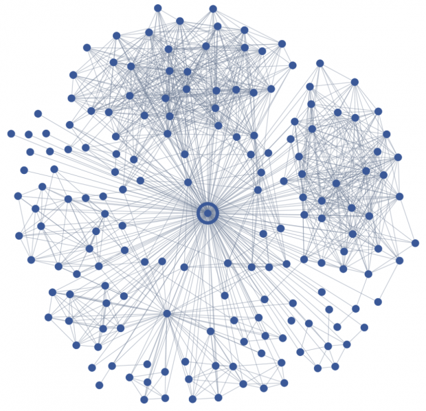 <!-- link directly to image on Web -->

<aside class="notes">
    Source: http://cdn3.computerhoy.com/sites/computerhoy.com/files/editores/user-20292/network-facebook.png
</aside>

## Anatomy + Radiology

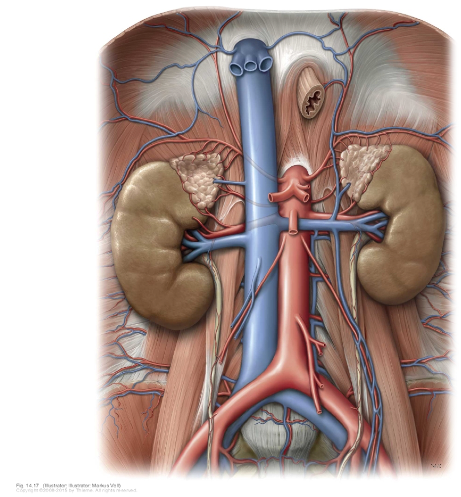{width=40%} 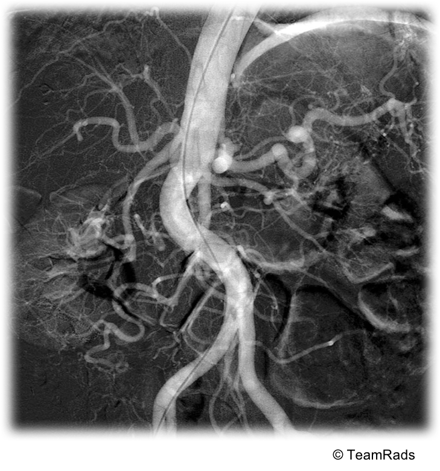{width=40%}

. . . 

Radiology: the way most clinicians see anatomy

<aside class="notes">
    Introductory Radiology is taught concurrently with Gross Anatomy at many medical schools. Opportunities exist to strength the integration of Radiology and Gross Anatomy to solidify cross-modality anatomic relationships, present clinical relevance, and foster early interest in the field of radiology.
</aside>

----

 <!-- link directly to image on Web -->

<aside class="notes">
Source: http://jennyschannel.blogspot.com/2012/09/armstrong-medical-education-building.html
</aside>

----

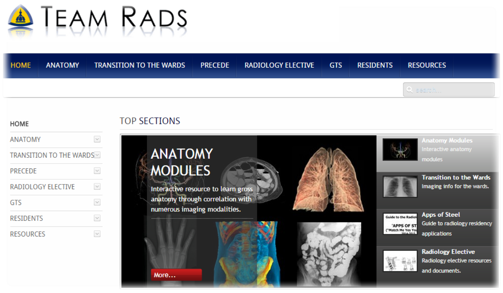

----

<aside class="notes">
    MIRC TFS is the backend software for most of the cases hosted on TeamRads.com. There are many cases created in MIRC TFS but not directly accessible on TeamRads.com.
</aside>

----

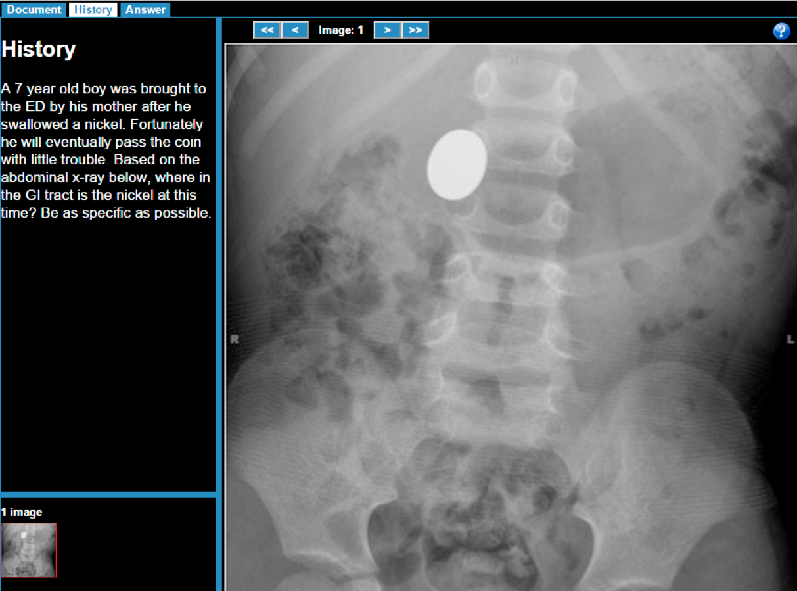

----

## Current Drawbacks

**Pull learning**: significant effort required

- Separate, non-integrated site
    * "Yet another system"
    * Homework: "Go to Section X, view Case Y..."
- *Ad hoc* pacing during self study
- Regular, spaced repetition lacking

<aside class="notes">
    TeamRads.com is not integrated into where anatomy materials are hosted (i.e. Blackboard). To my knowledge, there are no clickable links in electronic Anatomy course materials that allow the student to jump directly to relevant imaging material.
    
    Interestingly, an email-based system has been discussed in the past to promote spaced repetition. Given the widespread hatred for email, however, another solution would be ideal.
</aside>

## Goals

Deliver daily imaging cases *in step* with anatomy curriculum

- Reinforce high-yield anatomic relationships
- Reinforce key concepts in image interpretation
- **Push learning** to everywhere
    * Phone
    * Tablet
    * Computer
- Deliver content automatically
- Generate and measure student engagement

## Target Demographic

Students in JHUSOM Human Anatomy course,    
2014 and 2015

- Medical
- Biomedical Engineering
- Medical & Biological Illustration

*N* ≈ 140

Opt-in participation

----

. . .

 <!-- link directly to image on Web -->

<aside class="notes">
    A public Facebook Page was created and promoted to the target demographic. Participants "Liked" (tracked) the Facebook Page, which enabled them to receive mobile and Web push notifications each time a new case was posted.
    In Facebook parlance, a "fan" is a user who has "Liked" a Page.
</aside>

----

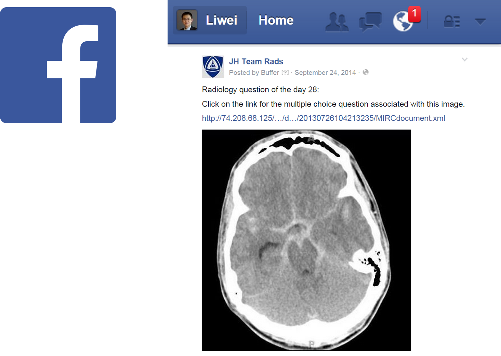

----

 <!-- link directly to image on Web -->

<aside class="notes">
    Having created a Facebook Page is well and good, but it would be a pain to post stuff to the Page manually every day. Unlike Taylor Swift, who may find the occasion to live-Tweet (or live-Facebook) "I had an amazing lunch today," our content is pre-planned, not composed live. That's where Buffer comes in.
</aside>

----

<aside class="notes">
    Buffer is a Web tool that interfaces with social media accounts. One useful function is to post to multiple social networks at once, which at the present is not necessary but may become useful in the future.
</aside>

----

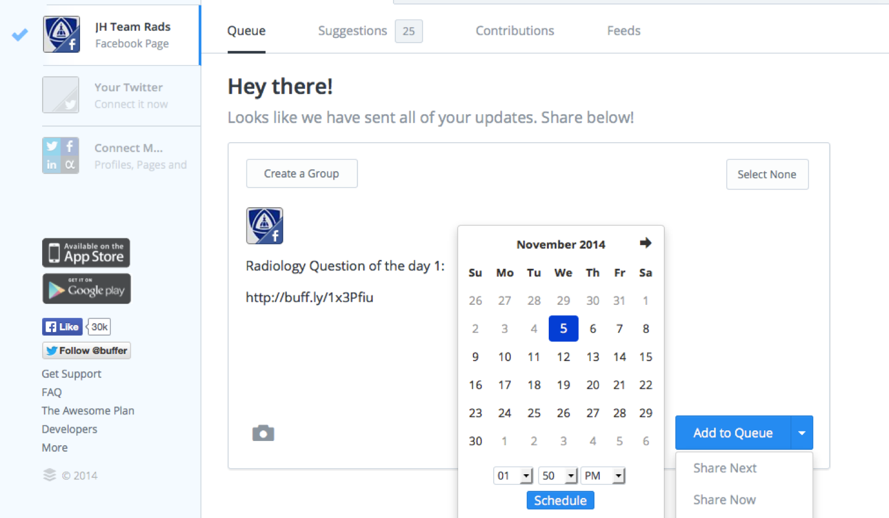

<aside class="notes">
    Another function of Buffer that we find much more useful is the ability to write a bunch of posts ahead of time, save them into a queue, and then set exactly when and how often the posts will be released onto Facebook (or all the other social networks). 
</aside>

----

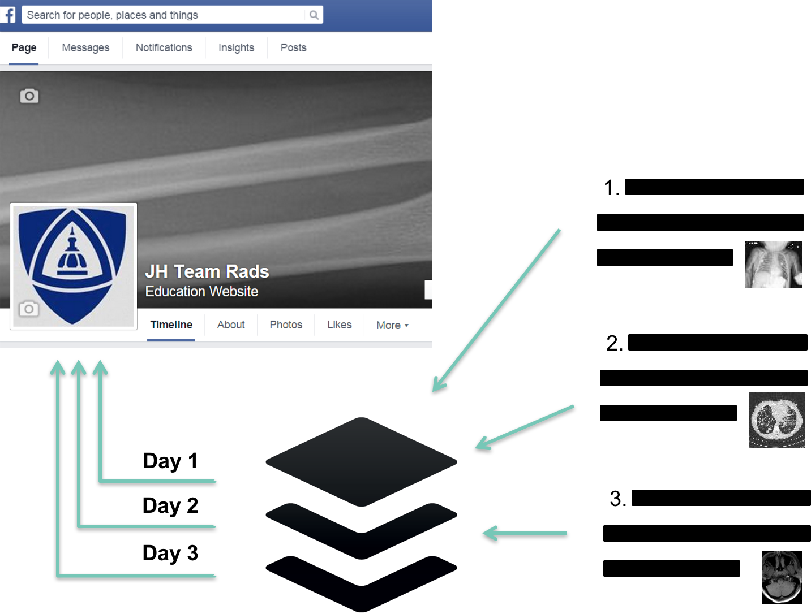{width=75%}

All cases are carefully de-identified

<aside class="notes">
    Here is the workflow. We put together a series of imaging cases that fit well with the anatomy curriculum. We stored the cases in the correct order in Buffer, and we set Buffer to post the cases to our Facebook Page every weekday.
</aside>

## Structural Limitations

- Not everyone uses Facebook
- Previous year's participants not excluded
- Facebook Page is public; anyone could
    * "Like" the Page
    * View the questions
    * Be tracked by Facebook’s analytics

<aside class="notes">
    Facebook users not enrolled in Johns Hopkins Human Anatomy and participants in 2014 who "self-participated" in 2015 could not be reliably excluded. Creating a new Page every year is an option, but manual labor is increased.
</aside>

----

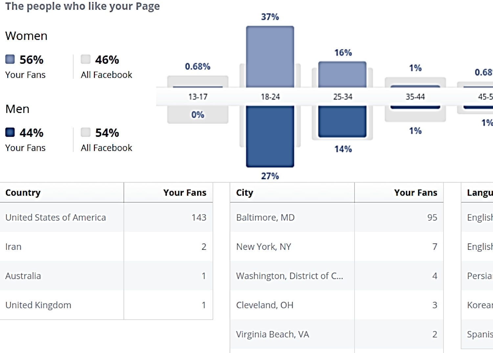

<aside class="notes">
    Note that number of participants exceeds class size, and several participants are not from Baltimore.
</aside>

----

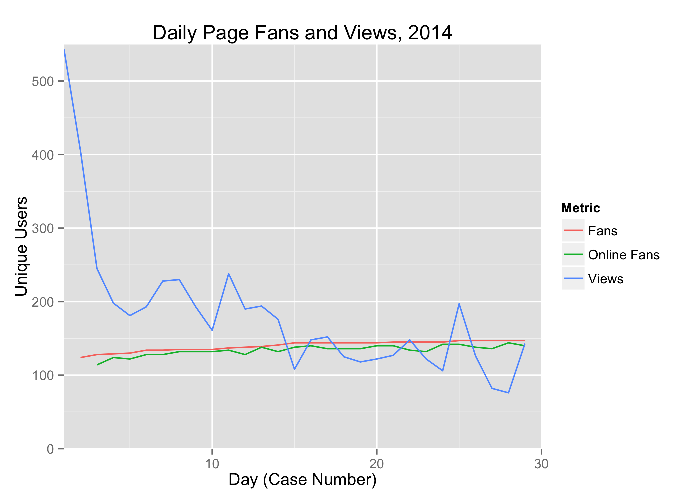

<aside class="notes">
    It becomes immediately apparently that on some days there are many more Page views from unique users than the number of fans we have. This is due to Facebook's algorithm of maximizing the Page's exposure. 
    All measures are "unique users."
</aside>

----

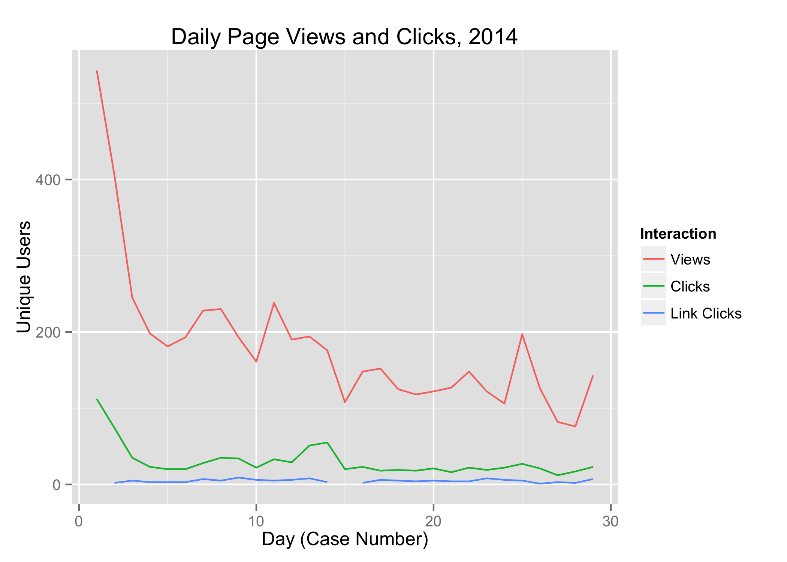

----

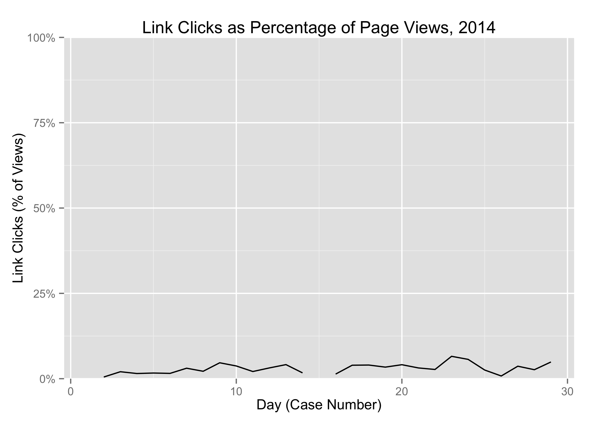

----

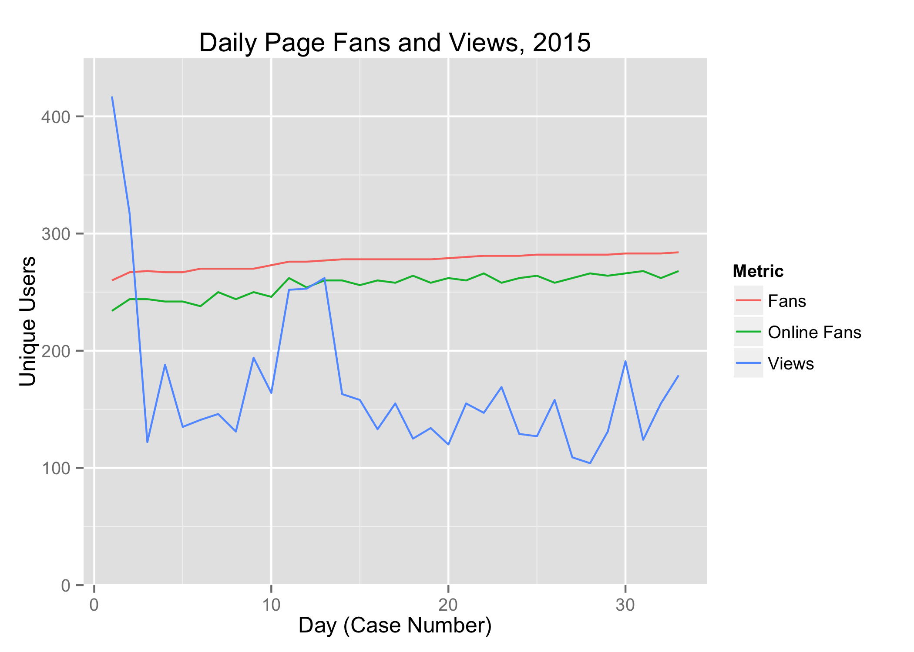

----

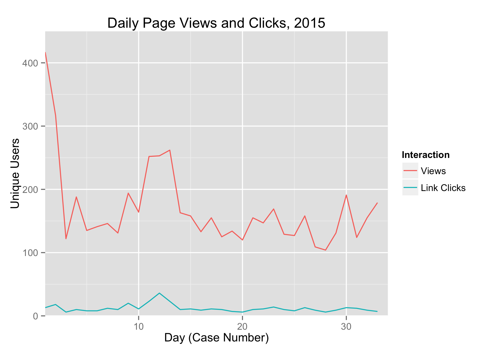

----

----

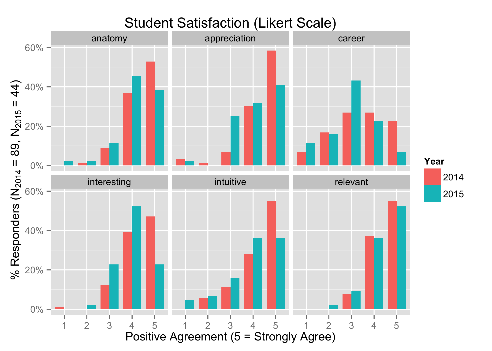

<aside class="notes">
    >70% of responders each year agreed that the cases were relevant, interesting, enhanced one’s understanding of anatomy material, and increased one’s appreciation for imaging as a diagnostic tool. The only exception was whether the cases increased one's desire to explore radiology as a practice. I would not expect to convince students that easily!
</aside>

## Limitations

- Not everyone uses Facebook
- Previous year's participants not excluded
- Facebook Page is public; anyone could
    * "Like" the Page
    * View the questions
    * Be tracked by Facebook’s analytics

. . .

- Facebook algorithm may limit *and* broaden audience of content
    * Neither desirable in controlled environment
- Participants free to ignore content being delivered
- Currently unable to directly assess learning enhancement
    
## Future Directions

- **Reach**: Find additional mechanisms of case delivery
    * Other social networks
    * Non - social media channels
- **Control**: Consider limiting content accessibility strictly to target demographic
    * "Tighter" metrics
    * Creation of closed group may conflict with openness
- **Quality**: Continue to improve and add imaging cases
- **Responsibility**: Incorporate testing to assess educational impact

<aside class="notes">
    Last point included to address reviewer comments. Testing would be *very* difficult to do given the many other factors that would contribute to differences in test scores.
</aside>

## Conclusions

- Facebook and Buffer: powerful, information-rich, and synergistic tools
    * **Push learning** integrated with daily habits
    * Simplified administration with scheduled posts
    * Highly revealing participation metrics
    * *Caution: content reach may not be what is intended*

. . .

- Well received by students
    * Interesting, relevant cases
    * Greater understanding of both anatomy and radiology
    * Increased appreciation of imaging

. . .

Widely applicable to other educational scenarios

## Acknowledgments

Facebook, Inc.

Buffer

Foundations of Human Anatomy,    
The Johns Hopkins University School of Medicine

Institute for Excellence in Education

Supported by the M.R. and Evelyn Hudson Foundation

## Thank You!

Liwei Jiang    
<liwei.jiang@jhmi.edu>

### Mentor

Donna Magid, M.D., M.Ed.    
<dmagid@jhmi.edu>
